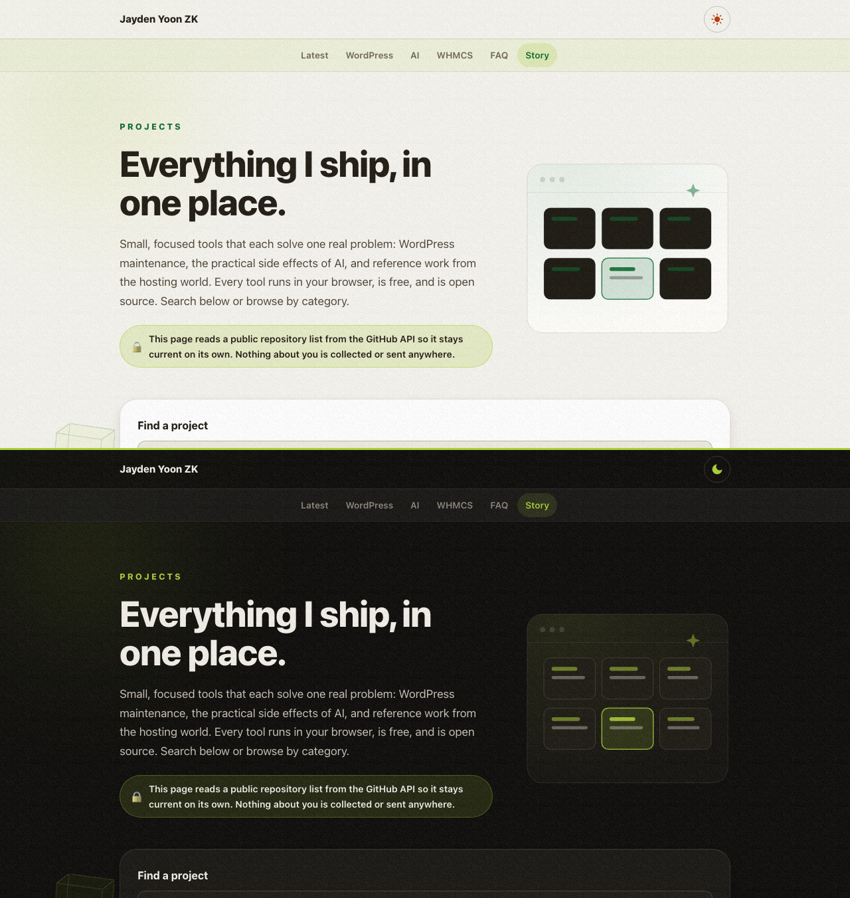

# Projects by Jayden Yoon ZK

Every tool I ship, in one place. A live, searchable directory: WordPress maintenance, the practical side effects of AI, and reference work from the hosting world.

**Browse it here: [jaydenyoonzk.github.io/projects](https://jaydenyoonzk.github.io/projects/)**



## What it does

- **Categories.** WordPress toolkit, Working around AI, WHMCS and hosting, plus a Latest strip sorted by real push dates.
- **Smart search.** Ranked matching across names, tags, categories, and descriptions. Press `/` to search, `Esc` to clear.
- **Cards that say enough.** Each project carries its scene, a one-line description, tags, and a live "updated" date. Click anywhere on a card to open the tool.
- **It updates itself.** The page reads my public repository list from the GitHub API on load: stars and dates refresh, the Latest strip re-sorts, and any new public repository appears automatically in its own section. If the API is unreachable, the curated directory still works, offline too.

## The tools it lists

| Tool | What it does |
| --- | --- |
| [WP Serial Fix](https://jaydenyoonzk.github.io/wp-serial-fix/) | Serialization-safe search and replace for WordPress data |
| [WP Config Doctor](https://jaydenyoonzk.github.io/wp-config-doctor/) | Audit and harden wp-config.php in the browser |
| [WP Plugin Checkup](https://jaydenyoonzk.github.io/wp-plugin-checkup/) | Find removed and abandoned plugins in a plugin list |
| [AI Paste Cleaner](https://jaydenyoonzk.github.io/ai-paste-cleaner/) | Reveal and clean hidden Unicode in copied text |
| [AI Crawler Audit](https://jaydenyoonzk.github.io/ai-crawler-audit/) | Read robots.txt the way AI crawlers do |
| [Package Reality Check](https://jaydenyoonzk.github.io/package-reality-check/) | Verify dependencies exist on npm and PyPI |
| [WHMCS Emoji Compatibility Guide](https://jaydenyoonzk.github.io/whmcs-emoji-compatibility-guide/) | Which emoji survive WHMCS |

## Development

The page is static: `docs/` is the whole site. The search and merge logic lives in [`docs/directory.js`](docs/directory.js) as a dependency-free ES module.

```sh
npm test
```

## License

[MIT](LICENSE)
